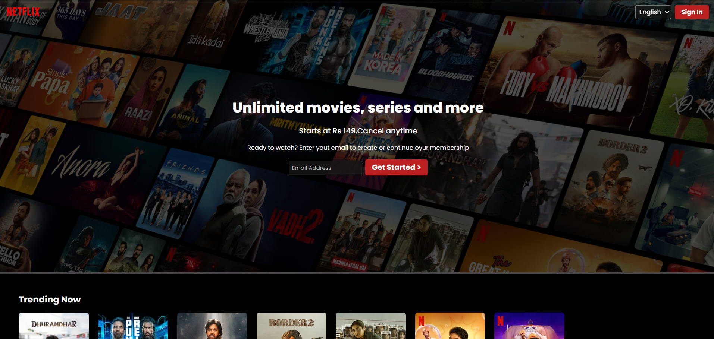
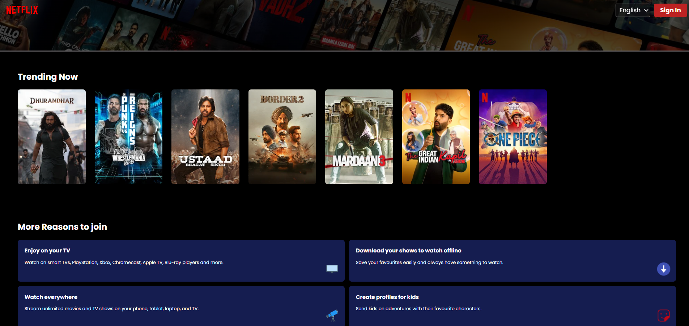

# 🎬 Netflix Clone (Work in Progress)

This is a Netflix landing page clone built using HTML and CSS.

## Current Features

* Responsive fixed navbar (overflow issue fixed)
* Hero section with background overlay (gradient)
* Email input with CTA button
* Horizontal scrolling movie row (like Netflix)
* "More reasons to join" card section
* Mobile-first responsive layout using media queries

## UI Highlights

* Flexbox and Grid-based layout
* Reusable card components
* Clean spacing and alignment
* Basic hover effects (movie cards, buttons)

## Tech Stack

* HTML5
* CSS3

## What I’m Learning

* Flexbox and CSS Grid in real layouts
* Responsive design using media queries
* Debugging layout issues (overflow, alignment)
* Structuring UI like real-world applications

## Challenges Faced

* Fixing navbar overflow on small screens
* Handling flexbox alignment issues
* Making layout responsive across devices
* Positioning elements like icons properly inside cards

## Upcoming Features

* Add JavaScript interactivity
* Improve animations and transitions
* Enhance mobile responsiveness
* Add dynamic movie data (future plan)

## Status

⏸️ Paused – Will continue after learning JavaScript

## Preview

  

  

